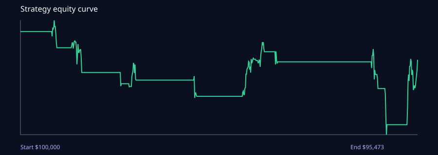

# Master backtest report

## Result status

The only committed result is a **representative exploratory historical simulation**, not an
out-of-sample or walk-forward result. It does not pass the evidence bar for use as a trading
claim. The poor result is retained because negative, reproducible evidence is more useful than a
cherry-picked strategy.

## Reproducible run

| Field | Value |
| --- | --- |
| Artifact | `reports/backtests/msft-3y-backtest.json` |
| Retrieval date | 2026-08-29 |
| Data provider | yfinance, adjusted daily OHLCV convenience adapter |
| Instrument / benchmark | MSFT / SPY |
| Data window | 2023-08-28 through 2026-08-27 (753 bars) |
| Strategy | fixed momentum/pullback score >= 65, long-only |
| Decision / execution | completed-session close / next regular-session open |
| Costs | 2 bps half spread + 5 bps slippage each way; zero commission |
| Split | None — exploratory only; not eligible for promotion |

## Exploratory metrics — do not treat as out-of-sample

| Metric | Strategy | SPY benchmark |
| --- | ---: | ---: |
| Total return | -4.53% | 80.77% |
| CAGR | -1.54% | 21.95% |
| Sharpe / Sortino / Calmar | -0.13 / -0.07 / -0.09 | Not calculated in this artifact |
| Maximum drawdown | -17.99% | Not calculated in this artifact |
| Win rate / profit factor | 41.67% / 0.79 | — |
| Trades / average holding | 24 / 3.79 sessions | — |
| Exposure / turnover | 13.41% / 6.37% | — |
| Alpha / beta / information ratio | -3.38% / 0.11 / -1.33 | — |

## Interpretation

The fixed single-stock rule substantially underperformed SPY in this window. It is therefore not
a candidate for paper deployment. It remains a regression artifact for the event engine, costs,
and report schema only.

## Required next evidence

- **In-sample:** choose only after a predeclared train/validation protocol.
- **Out-of-sample:** run the purged expanding folds in `swing_research.walkforward` across multiple
  point-in-time universes and regimes.
- **Forward/paper:** store predictions before any outcomes and report separately from historical
  simulations.
- **Biases and limits:** this run lacks delisting-aware historical constituents, point-in-time
  fundamentals/news, full bid/ask data, capacity analysis, and vendor revision history.

## Point-in-time universe coverage audit — rejected

| Field | Value |
| --- | --- |
| Artifact | `reports/backtests/universe-coverage-2020-01-02.json` |
| Membership snapshot | 505 S&P 500 constituents as of 2020-01-02 |
| Membership source | MIT-licensed community interval file, pinned commit `c31ac3cc56f28cf9a02b4e694eff7ceab596a0ff` |
| Price provider | yfinance / Yahoo convenience adapter |
| Price coverage | 436 / 505 = **86.3%** |
| Required coverage | 98.0% |
| Result | **Rejected** — 69 historical members unavailable |

The point-in-time membership data itself is not sufficient. Yahoo no longer returns usable bars
for many former tickers, mergers, and renamed companies. The audit artifact retains every missing
symbol and the CLI exits non-zero. No historical stock-universe result may be generated from this
provider until a delisting-aware price vendor passes the same coverage audit.

The separate 2024-01-02 snapshot also failed: 480 of 503 members (95.4%) were available, still
below the 98% gate. Its raw evidence is retained in
`reports/backtests/universe-coverage-2024-01-02.json`; a short recent window does not justify
silently accepting a lower coverage standard.
